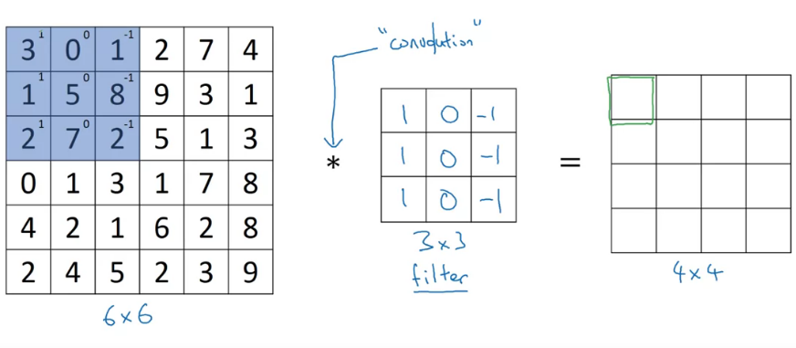
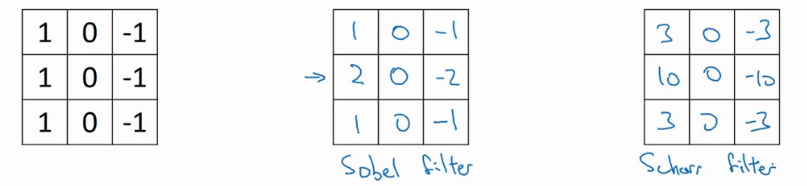
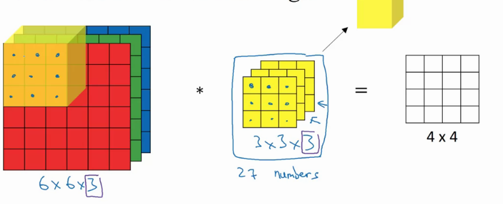
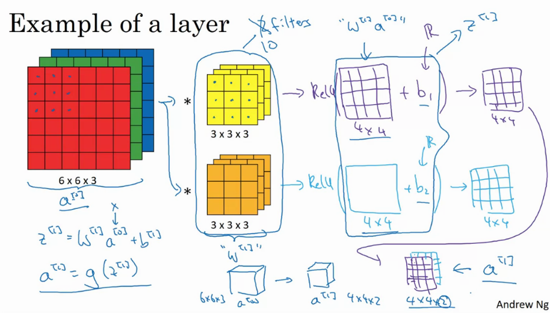
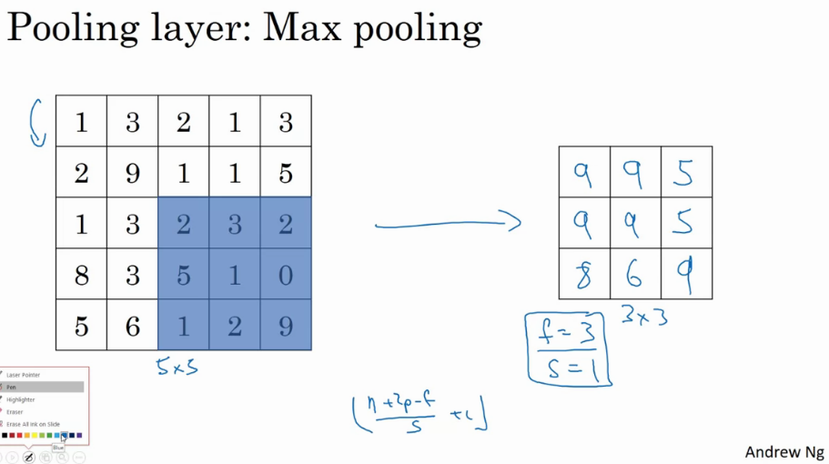
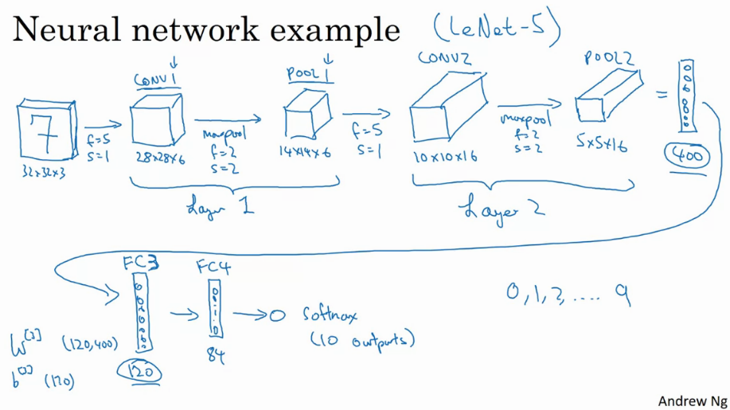
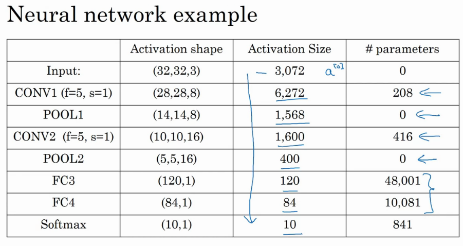
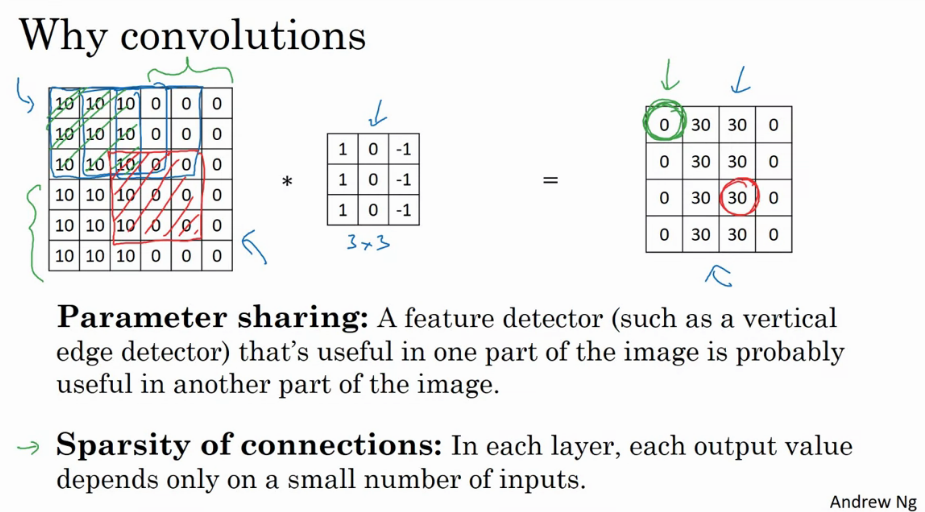
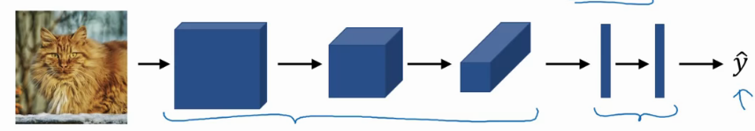

# Week 1 notes

## Computer vision

### Staple problems

1) Image classification (what)
2) Object detection (what + where)
3) Neural Style Transfer (repaint image in different style)

### Challenges

* can get really high dimensions
* ie. 64x64x3 image = 12288 dims!
* 1MP = 1000px $\times$ 1000px $\times$ 3 = 3 million input features
* If the first hidden layer has 1000 hidden units, the weights between input and first hidden layer will be a (1000, 3million) matrix --> 3 billion parameters
* It becomes difficult to prevent the network from overfitting

## Convolution

### Edge detection example

* early layers of NN will detect edges, later layers parts of objects, later later layers faces etc.

How to detect edges in images?

1) detect vertical edges
2) detect horizontal edges

Given a random matrix, you can multiply it with a "kernel" or "filter". Now you can *convolve* it with the image. The output of the convolved image will be a intermediate image. To get the first element in the output 4x4 matrix below, we take the filter and apply it to the topleft most possible area, calculating the resulting elementwise product, and summing it. This means the top left element of the matrix below becomes: 

$$ 3\times1 + 1\times1 + 2\times1 + 0\times0 + 5\times0 + 7\times0 + 1\times-1 + 8\times-1 + 2\times-1 = -5$$



Now we can move the filter to the right by the *stride*, one pixel in this case. Now we can get the same elementwise product + addition.

In python we can do this as follows:

```python
def conv_forward():
    ...

# in tensorflow:
tf.nn.conv2d()

# in keras:
Conv2D()

```

`The edge detector is just bright pixels on the left (1), dark pixels on the right (-1), we dont really care about the middle (0)`

In summary: different filters allow you to find vertical / horizontal edges. There are different ones that allow you to do the same thing, for example the Sobel filter, Scharr filter, ...



With deep learning, we can *learn* the filter to do edge detection:


### Padding

If the input image is of size $m\times n$, the filter is of size $k\times l$, and the stride is $s$, then the output image will be of size $m-k+s \times n-l+s$. In the case above: $6\times 6 \quad\textnormal{conv}\quad 3\times 3 = 6-3+1 \times 6-3+1 = 4\times4$.

The downside of this is that your image always shrinks. A second downside is that the edge pixels of the image are only used once, where pixels in the middle are used many times.

To fix this, you can pad the image before applying the convolution operation. You can add $p$ pixels around the image, so that the output image will remain of constant size (p*2 because you pad both on left and right). If $p=1$: 

$\overbrace{6+2p\times 6+2p}^{8 \times 8} \quad\textnormal{conv}\quad 3\times 3 = 8-3+1 \times 8-3+1 = 6\times6$

$$ n + 2p - f + 1 \times n + 2p - f + 1$$ (1)

Equation (1) shows the essential formula for square images. (n=m, k=l)

* valid convolutions --> no padding
* same convolutions --> padding makes that the output image is of same size as input image. The size of the padding should be function (2) of the filter size $f$. $f$ is usually *odd*

$$ p = \frac{f-1}{2}$$ (2)

### Strided convolutions

* Stride = the amount of pixels that you shift the filter

If you have an $n\times n$ image and you convolve it with an $f\times f$ filter, with padding $p$ and stride $s$, the output image will be

$$\textnormal{output\_size} = \Bigg\lfloor\frac{n+2p-f}{s} + 1\Bigg\rfloor \quad\times\quad \Bigg\lfloor\frac{n+2p-f}{s}+1\Bigg\rfloor$$ (3)

Where the floor function makes sure that if the filter does not fit the image entirely, you will have one less in size in the output image.

### Cross-correlation vs convolution

Convolution in a math textbook first flips the filter vertically followed by horizontally. In DL, we skip the flipping part, so actually cross-correlation is a better name. However, by convention this is called convolution.

`By convention, in DL we don't use flipping vertically, followed by horizontally. We just call it the convolution operator. Omitting this just simplifies the code.`

### Convolutions over volumes

* Imagine now images that have a 3rd dimension. (rgb)
* Now the filter will also have 3 layers (rgb)

The dimensions are

$$ \underbrace{h}_{height} \times \overbrace{w}^{width} \times \underbrace{c}_{\#channels} $$

The number of channels between image and filter is equal.
A filter can look only at a specific channel. For example making a red edge detector. The resulting output image is a single channel image, because we do the sum of the elementwise mulitplication, so we end up with a scalar.



What if want to use multiple filters at the same time?

* Do convolution with each of the filters, and stack the output images.


If we have an $n \times n \times n_c$ image, and an $f \times f \times f_c$ number of channels, where $f_c = n_c$, the output image will have size (with $n_c' =$ the number of filters).

$$ n \times n \times n_c \quad\textnormal{conv}\quad  f \times f \times f_c \Rightarrow n-f+1 \times n-f+1 \times n_c'$$

## One layer of a convolutional network

Example of a layer:

* After applying the convolution(s) between an input image and a bunch of filter(s), we add a bias and apply a non-linearity (like relu), to get output


One step of forward propagation

$$ \ssb{z}{1} = \underbrace{\ssb{w}{1}}_{\textnormal{filters}}\overbrace{\ssb{a}{0}}^{\textnormal{input}} + \ssb{b}{1}$$
$$ \ssb{a}{1} = g(\ssb{z}{1})$$

So that the input images are $\ssb{a}{0}$, the filters are $\ssb{w}{1}$, the output 4x4 matrix is $\ssb{w}{1}\ssb{a}{0}$, and the actual output is $\ssb{a}{1}$. 



### Number of params in one layer

* imagine 10 filters, size 3x3x3
* How many params in layer?

Each filter has 27 parameters, + a bias unit, so 28 parameters. Imagine that you have 10, that means we have 280 parameters. `Notice that no matter how big the input image is, the number of parameters remains constant.`

### Notations

* $\ssb{f}{l}$ = filter size of filter in layer $l$
* $\ssb{p}{l}$ = amount of padding in layer $l$ (valid = no padding, same = inputsize=outputsize)
* $\ssb{s}{l}$ = stride in layer $l$
* $\ssb{n_c}{l}$ = number of filters in $l$
* Each filter is: $\ssb{f}{l} \times \ssb{f}{l} \times \ssb{n_C}{l-1}$
* Activations: $\ssb{a}{l} \rightarrow \ssb{n_H}{l} \times \ssb{n_W}{l} \times \ssb{n_C}{l}$
* $m$ is number of samples
* $\ssb{A}{l} \rightarrow m \times \ssb{n_H}{l} \times \ssb{n_W}{l} \times \ssb{n_C}{l}$ = set of activations. Order is important!
* Weights: $\ssb{f}{l} \times \ssb{f}{l} \times \ssb{n_C}{l-1} \times \ssb{n_C}{l}$ filter size times number of channels in input vs current layer.
* Bias: $\ssb{n_C}{l} - (1, 1, 1, \ssb{n_C}{l})$
* Input: (input of layer $l$ is what you had as output in layer $l-1$)

$$\ssb{n_H}{l-1} \times \ssb{n_W}{l-1} \times \ssb{n_C}{l-1}$$

* Output:

$$\ssb{n_H}{l} \times \ssb{n_W}{l} \times \ssb{n_C}{l}$$

* Output size is given by:

$$\ssb{n_H}{l} = \Bigg\lfloor\frac{\ssb{n_H}{l-1} + 2\ssb{p}{l} - \ssb{f}{l}}{\ssb{s}{l}} + 1 \Bigg\rfloor$$ (4)

$$\ssb{n_W}{l} = \Bigg\lfloor\frac{\ssb{n_W}{l-1} + 2\ssb{p}{l} - \ssb{f}{l}}{\ssb{s}{l}} + 1 \Bigg\rfloor$$(5)

* and the number of channels in the output is given by the number of filters that we are using in this layer $l$.


## A simple convolution network example

* imagine you want to classify an image as a cat or not a cat. 
* Input image 39x39x3
* $\ssb{n_H}{0} = \ssb{n_W}{0} = 39$
* $\ssb{n_C}{0} = 3$
* $\ssb{f}{1} = 3$
* $\ssb{s}{1} = 1$
* $\ssb{p}{1} = 0$
* 10 filters

The next layer will have a volume of 37x37x10 (10 filters, following (4) and (5)). This now becomes the input size for the second layer

* $\ssb{n_H}{1} = \ssb{n_W}{1} = 37$
* $\ssb{n_C}{1} = 10$
* $\ssb{f}{2} = 5$
* $\ssb{s}{2} = 2$
* $\ssb{p}{2} = 0$
* 20 filters

The next layer will have a volume of 17x17x20 (20 filters, following (4) and (5)). This now becomes the input size for the third layer


The last layer can be unrolled into a vector of 7x7x40 =1960 elements, then we can use this as a softmax / logistic regression  layer to predict the final output $\hat{y}$

Typically you start off with larger images, and the height and width will go down and the number of channels will increase.

Types of layers in a convnet

* Convolution layer (conv)
* Pooling layer (pool)
* Fully connected layer (fc)

## Pooling layers:

### max pooling

* break your input into subs, and take the max of these numbers as the value of the output. You can also see this as a filter with size $f$, with stride $s$.
* Intuition: a large number has a strong feature. If this feature is detected anywhere, then keep a high number.
* It's used alot because it works well.
* There are NO parameters to learn.
* formula's of conv layers (4)(5) also work in maxpooling



This extends to a channel dimension too, so if we have $n_c$ input channels, the output will also have $n_c$ channels.

### Average pooling

* takes average instead of max
* use if you want to collapse your size from ie 7x7x1000 to 1x1x1000.

### Common settings

* $f=2 / 3$
* $s=2$
* shrinks height and width by factor 2 / 3
* max/average pooling
* padding typically not used
* pooling applies to each of your input channels independently

$$ \textnormal{input=}n_H \times n_W \times n_C \quad\textnormal{output:} \Bigg\lfloor\frac{n_H - f}{s} + 1 \Bigg\rfloor \times \Bigg\lfloor\frac{n_W - f}{s} + 1\Bigg\rfloor \times n_C$$

* NO PARAMETERS TO LEARN, fixed function.

## CNN Example

* Recognize number in 32x32x3 image
* Similar to LeNet-5

### Layer 1

#### conv1

* f=5
* s=1 
* 6 filters
* output: 28x28x6

#### pool1

* maxpool
* f=2
* s=2
* (p=0)
* output: 14x14x6

### Layer 2

#### conv2

* f=5
* s=1
* 10 filters
* output: 10x10x16

#### pool2

* f=2
* s=2
* output: 5x5x16

### Flatten

* 5x5x16 = 400 units

### Layer 3

#### fc3 

* output: 120 units

### Layer 4

#### fc4

* output: 84 units

### Softmax

* 10 outputs



* Hyperparameters
    * dont choose yourself
    * look at literature

Essentially: 

conv - pool - conv - pool - fc - fc - fc - softmax

To calculate the activation size / number of parameters, take the multiplication of the number of input n_c, n_h, n_w.

* notice that pooling have 0 parameters
* conv have relatively few parameters
* most parameters are in the fc layers of the network
* activation size goes down the deeper you go




Here are the 5 typos:

1. 208 should be (5x5x3 + 1) * 8 = 608

2. 416 should be (5x5x8 + 1) * 16 = 3216

3. In the FC3, 48001 should be 400*120 + 120 = 48120, since the bias should have 120 parameters, not 1

4. Similarly, in the FC4, 10081 should be 120*84 + 84 (not 1) = 10164

(Here, the bias is for the fully connected layer. In fully connected layers, there will be one bias for each neuron, so the bias become In FC3 there were 120 neurons so 120 biases.)

5. Finally, in the softmax, 841 should be 84*10 + 10 = 850

### Why convolutions? (over fully connected)

* parameter sharing
* sparsity of connections

The weight matrix between fully connected layers becomes really big really quick. For example 32x32x3 image after the first layer in LeNet 5 will be 14million params......

However, in conv layer we only have 25+1 (bias) params per filter, and at 6 filters that means we have 156 parameters.

#### Parameter Sharing

* A feature detector / filter that's useful in one part of the image is probably also useful in another part of the image.

#### Sparsity of connections

* In each layer, each output value depends only on a small number of inputs.



`Convolutional layers are translation invariant (a cat moved a few pixels is still a cat)`

#### Lets say you want to build a cat detector

* Given training set $\trainingset$
* and a network architecture



* we can compute a cost: 

$$ \textnormal{Cost} \quad J = \frac{1}{m} \sum_{i=1}^m \mathcal{L}(\hat{y}^{(i)}, y^{(i)})$$

* then use GD to optimize parameters to reduce $J$.

# Tensorflow notes

Create placeholders for the input image X and the output Y. You should not define the number of training examples for the moment. To do so, you could use "None" as the batch size, it will give you the flexibility to choose it later. Hence X should be of dimension **[None, n_H0, n_W0, n_C0]** and Y should be of dimension **[None, n_y]*
```python
### START CODE HERE ### (≈2 lines)
X = tf.placeholder(tf.float32, shape=(None, n_H0, n_W0, n_C0)) 
Y = tf.placeholder(tf.float32, shape=(None, n_y)) 
### END CODE HERE ###

```

Reminder - to initialize a parameter $W$ of shape [1,2,3,4] in Tensorflow, use:
```python
W = tf.get_variable("W", [1,2,3,4], initializer = ...)
```

## Common layers

- **tf.nn.conv2d(X,W, strides = [1,s,s,1], padding = 'SAME'):** given an input $X$ and a group of filters $W$, this function convolves $W$'s filters on X. The third parameter ([1,s,s,1]) represents the strides for each dimension of the input (m, n_H_prev, n_W_prev, n_C_prev). Normally, you'll choose a stride of 1 for the number of examples (the first value) and for the channels (the fourth value), which is why we wrote the value as `[1,s,s,1]`. You can read the full documentation on [conv2d](https://www.tensorflow.org/api_docs/python/tf/nn/conv2d).

- **tf.nn.max_pool(A, ksize = [1,f,f,1], strides = [1,s,s,1], padding = 'SAME'):** given an input A, this function uses a window of size (f, f) and strides of size (s, s) to carry out max pooling over each window.  For max pooling, we usually operate on a single example at a time and a single channel at a time.  So the first and fourth value in `[1,f,f,1]` are both 1.  You can read the full documentation on [max_pool](https://www.tensorflow.org/api_docs/python/tf/nn/max_pool).

- **tf.nn.relu(Z):** computes the elementwise ReLU of Z (which can be any shape). You can read the full documentation on [relu](https://www.tensorflow.org/api_docs/python/tf/nn/relu).

- **tf.contrib.layers.flatten(P)**: given a tensor "P", this function takes each training (or test) example in the batch and flattens it into a 1D vector.  
    * If a tensor P has the shape (m,h,w,c), where m is the number of examples (the batch size), it returns a flattened tensor with shape (batch_size, k), where $k=h \times w \times c$.  "k" equals the product of all the dimension sizes other than the first dimension.
    * For example, given a tensor with dimensions [100,2,3,4], it flattens the tensor to be of shape [100, 24], where 24 = 2 * 3 * 4.  You can read the full documentation on [flatten](https://www.tensorflow.org/api_docs/python/tf/contrib/layers/flatten).

- **tf.contrib.layers.fully_connected(F, num_outputs):** given the flattened input F, it returns the output computed using a fully connected layer. You can read the full documentation on [full_connected](https://www.tensorflow.org/api_docs/python/tf/contrib/layers/fully_connected).


## Use the correct labels for your props! Need to use the labels defined in the placeholders field.


```python
    # Forward propagation: Build the forward propagation in the tensorflow graph
    ### START CODE HERE ### (1 line)
    Z3 = forward_propagation(X, parameters);  # use the correct labels,X this is just building a graph
    ### END CODE HERE ###
    
    # Cost function: Add cost function to tensorflow graph
    ### START CODE HERE ### (1 line)
    cost = compute_cost(Z3, Y) # use the correct labels, Y
```