# Week 2 Notes

## Case studies

* LeNet-5
* AlexNet
* VGG

Laid foundations for modern CV.

* ResNet (152)
* Inception

## Classic Networks

You shuold read them in the order: AlexNet (easy), VGG, LeNet(hard)

### LeNet-5

* digit recognition
* in that age everyone used "valid" convolutions
* Essentially 4 conv -> flatten -> fc -> fc -> logits / softmax $\hat{y}$

Architecture:

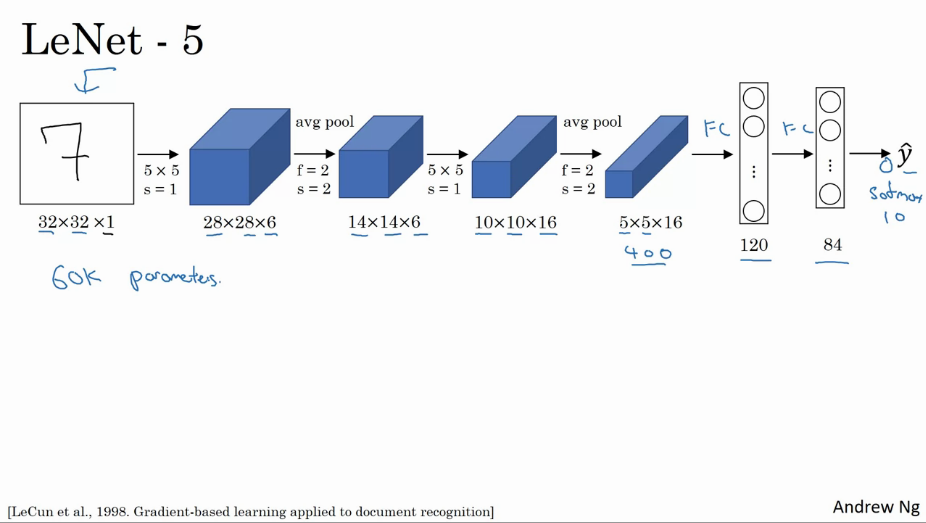

* Not unusual to see networks that are 1000 times bigger
* width / height goes down, number of channels goes up

`conv pool conv pool .... fc fc fc .. output`

#### Extra comments if you want to read LeNet-5

* use sigmoid/tanh instead of ReLU
* typically every filter looks at every channel, but original LeNet-5 will not do this, it will look at single channels and complex stuff because the network was already "big" back then
* original LeNet-5 uses sigmoid nonlinearity after pooling.

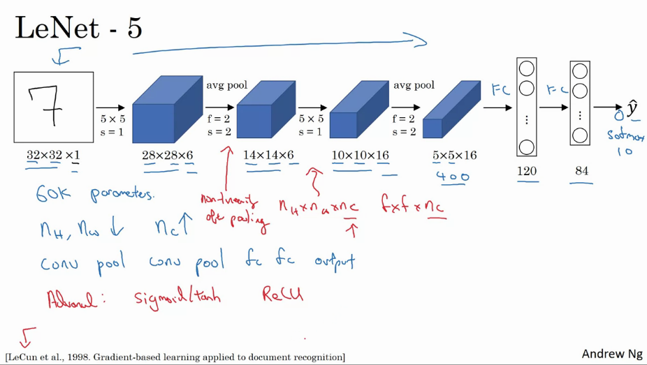

### AlexNet

* Original paper uses 224x224x3 but its actually 227x227
* Uses large stride, so dim shrinks quickly
* alot bigger than LeNet-5
* 8 convs, flatten, 3 fc, softmax
* very similar to LeNet-5
    * 60k params (LeNet) vs 60mil params (AlexNet)
* uses ReLU activation function

Architecture:

#### Extra comments if you want to read AlexNet

* uses complex training schedule on two GPU's
* uses Local Response Normalization
    * not used much
    * basic idea: looks at 1 position in H,W and look through all channels and normalize them. Inituition is that for each position in this 13x13 image you dont want too many neurons with very high activation
    * this doesnt help that much.
    * no one really uses it

* AlexNet was the gamechanger -> 2012.
* One of the easier ones to read

### VGG-16

* instead of having massive amounts of parameters, use smaller network
* **always** use conv 3x3 filters, stride=1 , same padding
* maxpool **always** 2x2, s=2
* much deeper network
* Essentially, because SAME convolutions and max pooling, the network shrinks very easily readable
* output = softmax (1000)
* 16 in name VGG-16 refers to 16 layers that have weights
* 138mil params...
* number of filters are always doubled 64-128-256-512
* relative uniform network
* in literature, VGG-19 is a bigger version of VGG-16.
* vgg-16 almost does as well

`pattern: if you go deeper, H and W go down, but channels increase`

Architecture:

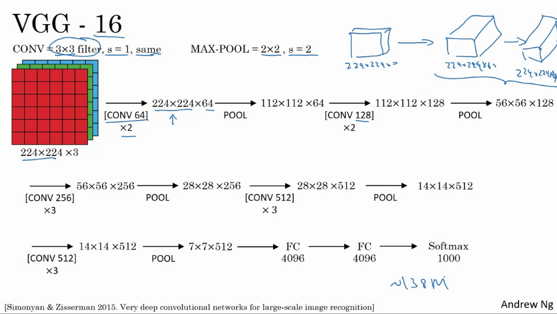

## ResNets: Residual Networks

* allows skip connections
* very deep > 100 layers

### Residual blocks

* $\overbrace{\ssb{a}{l} \underbrace{\rightarrow \textnormal{linear} \rightarrow \textnormal{ReLU} \rightarrow \ssb{a}{l+1} \rightarrow \textnormal{linear} \rightarrow}_{\textnormal{"shortcut / skip connection"}} \textnormal{ReLU} \rightarrow \ssb{a}{l+2}}^{\textnormal{main path}}$

$$\ssb{z}{l+1} = \ssb{W}{l+1}\ssb{a}{l} + \ssb{b}{l+1}$$
$$\ssb{a}{l+1} = g(\ssb{z}{l+1})$$
$$\ssb{z}{l+2} = \ssb{W}{l+2}\ssb{a}{l+1} + \ssb{b}{l+2}$$
$$\ssb{a}{l+2} = g(\ssb{z}{l+2})$$

* now, lets take $\ssb{a}{l}$ and make a "shortcut / skip connection". This makes that the output is

$$\ssb{a}{l+2} = g(\ssb{z}{l+2} + \ssb{a}{l})$$

* Using Residual Blocks allows to build alot DEEPER networks

### Residual "Plain Network"

* add all the skip connections to turn each of the blocks into residual blocks
* it turns out that if you use GD / ... As you increase the number of layers, the training error decreases but after a while it will go back up.
* in theory, having a deeper network should only help, but in reality the error goes back up
* helps with vanishing / explodin gradients

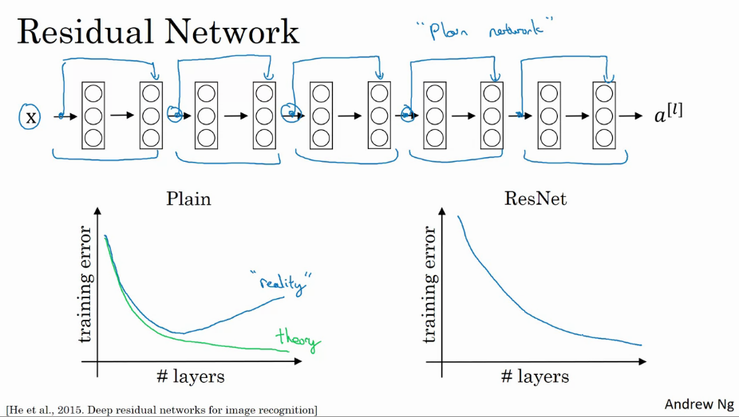

### Why ResNets work

* making bigger networks hurts the performance of the network
* this is not true if you use residual blocks

Lets start the idea with a big NN. A Different net will take the same network, but adds some extra layers in the form of a residual block

* Lets assume we use ReLU, so all activations are always greater than 0

$$\ssb{a}{l+2} = g(\ssb{z}{l+2} + \ssb{a}{l}) = g(\ssb{w}{l+2}\ssb{a}{l+1} + \ssb{b}{l+2} + \ssb{a}{l})$$

* if you apply weight decay or L2 regularization, that will tend to shrink the value of $\ssb{W}{l+2}$ (and b, but not as important). If this happens, the output becomes just equal to $\ssb{a}{l}$.
* the identity function is **easy** for residual blocks to learn because of the skip connection
* its difficult for normal networks to learn Identity, thats why larger networks hurt performance
* many times with residual blocks it will just help in performance

Some extra notes:

* Typically the SAME convolution is used, so the dimensions are also taken care of with the skip connection.
* if there is a difference in shape, we can add a new matrix to multiply so that the output becomes $W_s\ssb{a}{l}$ which is fo the same dimension.
* This matrix $W_s$ makes that the dimensions don't mismatch.
    * Can be a matrix with params to be learned
    * Can be a fixed matrix with zero padding: a_l with zero pads on the sides to make the dimensions work

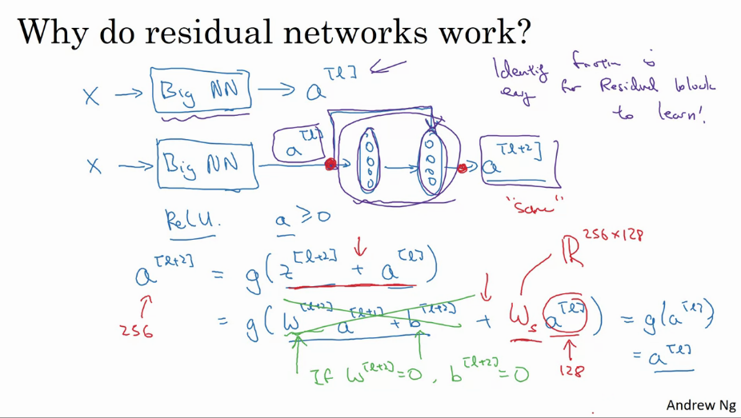

### ResNet on images

* start from plain network
* add skip connections
* there's alot of 3x3 **same** convolutions, thats why we add equal dimension vectors (dimension is preserved)
* When there's a pooling layer, you need to make an adjustment to the dimension
* The last layer is a fully connected layer that makes a prediction using softmax

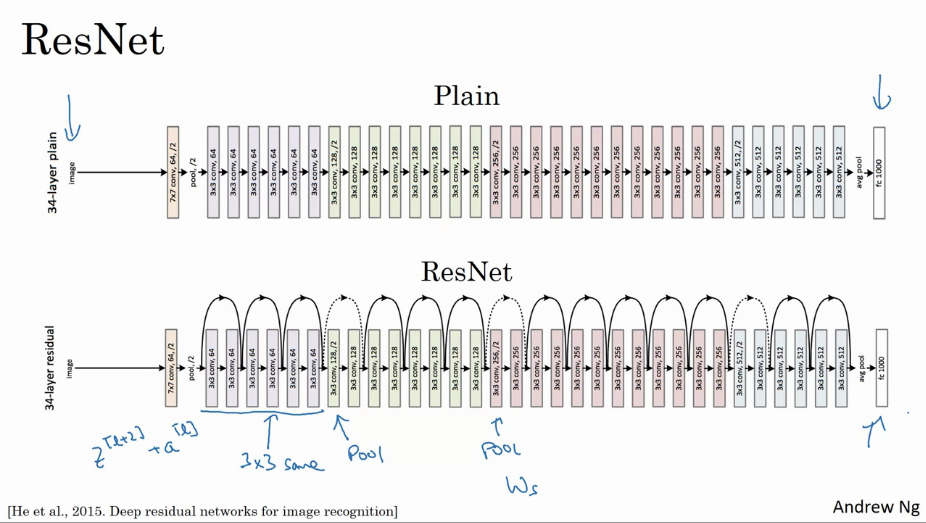

## Networks in Networks and 1x1 Convolutions

* 1x1 conv = multiplication is matmul with scalar
* However, in a high dimensional volume  (c>1), it makes more sense
    * look at each of the 32 different positions
    * takes elementwise product of 32numbers on the left and 32numbers of the filter.
    * after, it applies a relu
* think of it as one neuron that takes as input 32 numbers, multiplying them by 32 weights, applying nonlinearity and outputting
* if yuo have multiple convlutions, you have multiple units that take as input the slice and then building them up into a new output block

* its basically having a fully connected network that applies to each of the elements, so it takes as input 32 numbers and outputs a number of filters $\ssb{n}{l+1}_c$.
* can do difficult multiplication

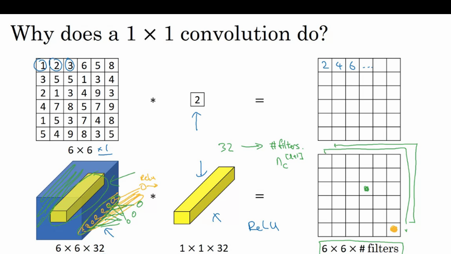

* also named "Network in Network" , by lin et al.
* An example of where a 1by1 conv is useful
    * if the number of channels is too big and you want to shrink it (ie go from 128 -> 32 channels)
    * you can also keep the number of channels constant/decrease/increase
    * `can just use this as an extra nonlinearity`

## Inception Network

* arch is more complex, but works really well
* instead of choosing what size of convolution you want, do them all
* stack up multiple blocks of convolutions, making the dimensions match up
* also include pooling. In order to make the dimensions match, you need to add padding.

Above is called an inception volume

* actually increases the number of channels
* You dont need to pick any filter size / ...
* Let the network learn what it needs

However, the computational cost is very big. Lets focus on the 5x5 convolution of the above image below.

* you have 32 filters
* each filter is 5x5x192
* output is 28x28x32
* this means that we need to calculate 28x28x32 x 5x5x192 = 120million computations for only this block

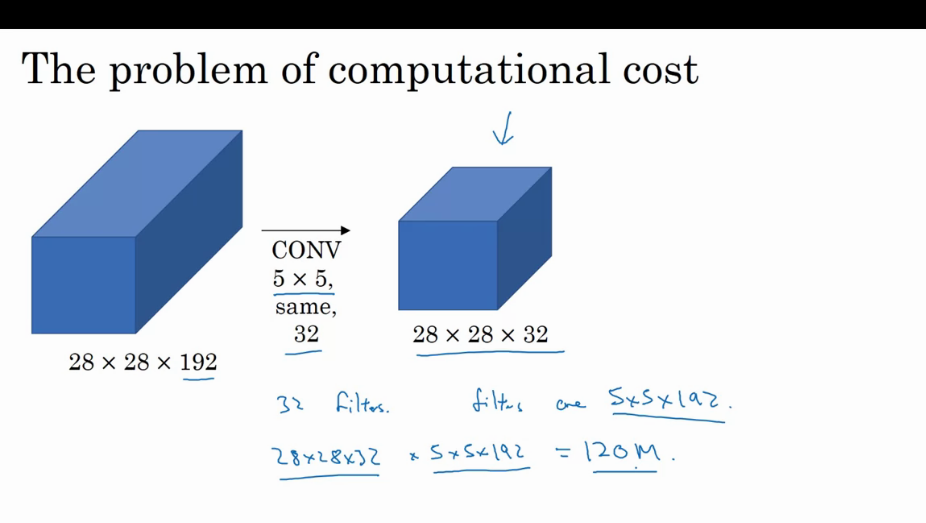

Alternatively, we can use a 1x1 convolution to a 16 channel volume and consequently run the 5x5 convolution to get the final output.

* the input / output size is the same
* essentially shrink to `an intermediate volume called a bottleneck layer`
* the computational cost is now 
    * First 1x1 conv: 28x28x16 (outputs) * 1x1x192 (multiplications) = 2.4mil
    * second 5x5 conv: 28x28x32 (outputs) * 5x5x16 = 10.0mil
    * total amount of multiplications = 12.4mil
    * the number of additions is about the same as the amount of multiplications
    * reduction of ~90%!
* as long as you implement this bottleneck layer within reason, you can shrink this layer quite significantly without significantly reducing the performance.

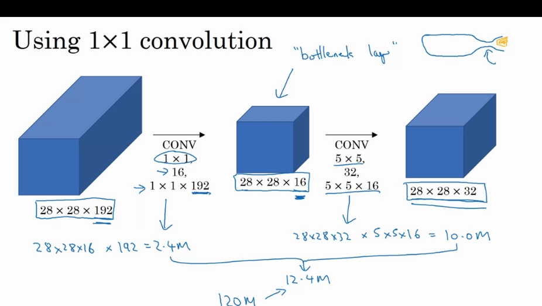

## Building an Inception Network

* Combine all the blocks
* in the pooling layer, remember to use SAME padding for pooling, so that the output height/width can be concatenated with the other outputs. Even after this it will have the same amount of channels! Add one more 1x1 conv layer to shrink the number of channels.

This is one inception module. InceptionNet uses many of these modules

* There are some extra max pooling layers to change the height and width of the network.

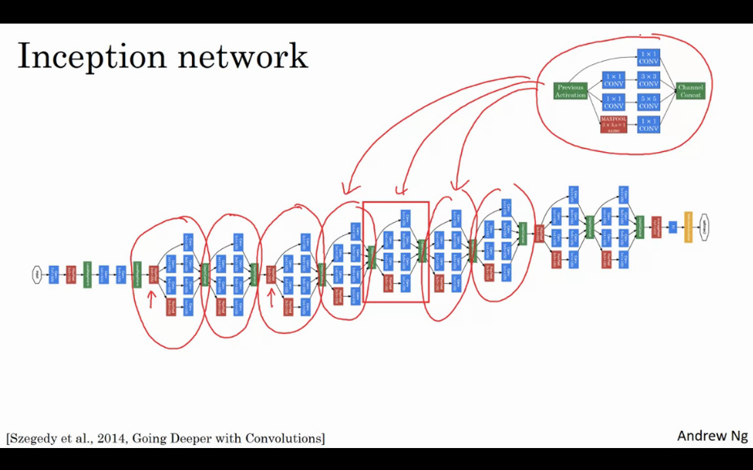

One more detail: there are side branches (green). They take a hidden layer and use that to make a prediction (softmax). 

* helps to ensure that the computed features in intermediate layers are not too bad
* helps preventing overfitting
* also goes by the name GoogLeNet :)

* inceptionNet actually refers this meme below, as motivation for the need to build deeper NN

## Practical advice for using ConvNets

### Using open source implementations

* many networks are difficult to replicate
* look online for an open source implementation: use authors implementation!
* re-implementation could be a good exercise

1) pick an architecture that you like
2) look for open source implementation
3) build from there

* sometimes these network take a very long time to train, we can use transfer learning to use stuff from others
* often, starting with open source implementations is a faster way to start on a new project.

### Transfer learning

* sometimes training takes many gpu's and going through the hyperparameter search process also takes long

Example: build pet detector and you want to detect your own cat.

* classification problem with 3 classes. 
    * Tigga 
    * Misty
    * neither

#### If your training set is small

1) go online and download an OS implementation + weights trained on for example ImageNet
2) get rid of the softmax layer (1000 outputs) and create your own softmax unit that outputs either one of the three options (tigga, misty, neither)
3) freeze all the other layers.
4) by using other peoples weights you dont need alot of training sample. Use parameters such as `trainableParameter=0 or freeze=1`

* One other trick is that you could precompute the activations of one layer and saving them to disk. This way you can train a shallow softmax model to predict. Now there is no need to precompute the activations whenever you take an epoch / pass through your training set.

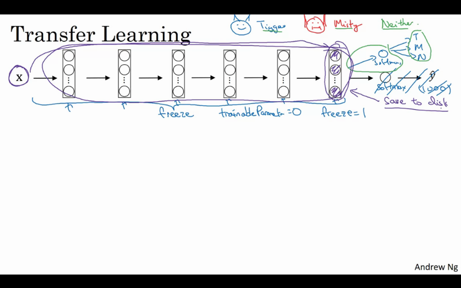

#### If your training set is medium

If you have a larger labelled dataset
* freeze fewer layers and train the later layers.
* You can also remove the last layers and add different ones.
* essentially, you can lower the amount of layers you freeze, and increase the amount of trainable layers

#### If your training set is large

* train the whole network
* use the previous weights as initialization (this replaces random initialization)
* The more pictures you have the more layers you can train
* this is the extreme case

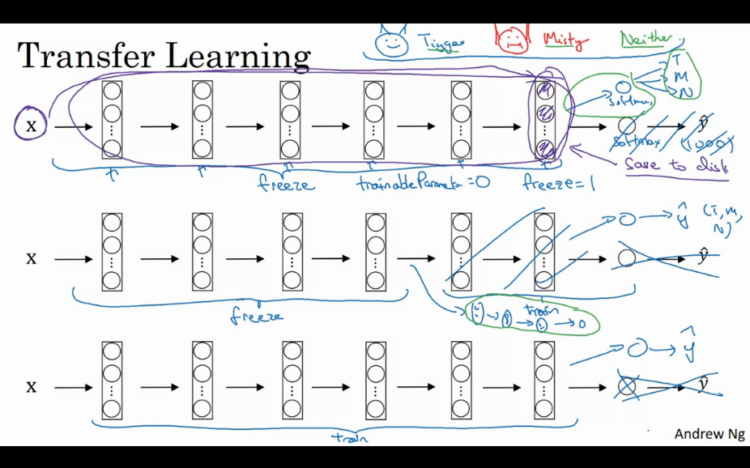

`For many applications you are better off downloading other people's weights. You should actually always do transfer learning unless you have an exceptionally large dataset and a very large computational budget`

### Data Augmentation

* for the majority of the cv problems, we just want as much data as possible
* that means that data augmentation will often help

#### Common augmentation methods

Mostly used

* mirroring
* random cropping (not perfect, but in practice it works well so long as your random crops are reasonably large subset of your original image)

Less used

* rotation
* shearing
* local warping..

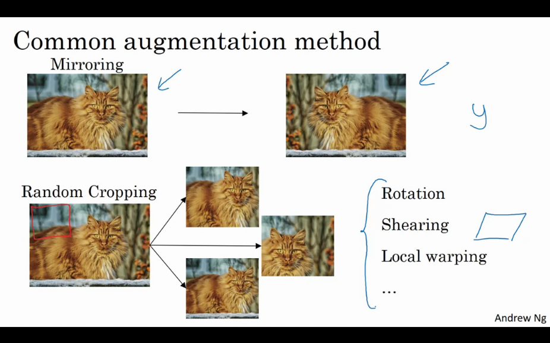

* color shifting: make additions / reductions on image channels.
    * makes new image that is less red/ more green /. ...
    * in practice, the changing values are drawn from a distribution
    * changes in color might be possible in the real world, so this makes your algo more robust vs that
    * there are different ways of sampling RGB
        * you can do PCA color augmentation
        * ie. if your image is mainly purple, ie mainly has red and blue tints and very little green, PCA color augmentation will add and subtract alot from red and blue but less from green

#### Implementing distrotions during training

* you have a stream of images coming from your harddisk
* use one cpu thread to implement a distortion
* many other distortions on other threads
* pass as a minibatch to some other thing like GPU from training
* commonly, data augmentation is implemented by taking 1 or more threads to do the distortions and then passing it to something else like gpu
* typically the augmentation and gpu stuff can run in parallel

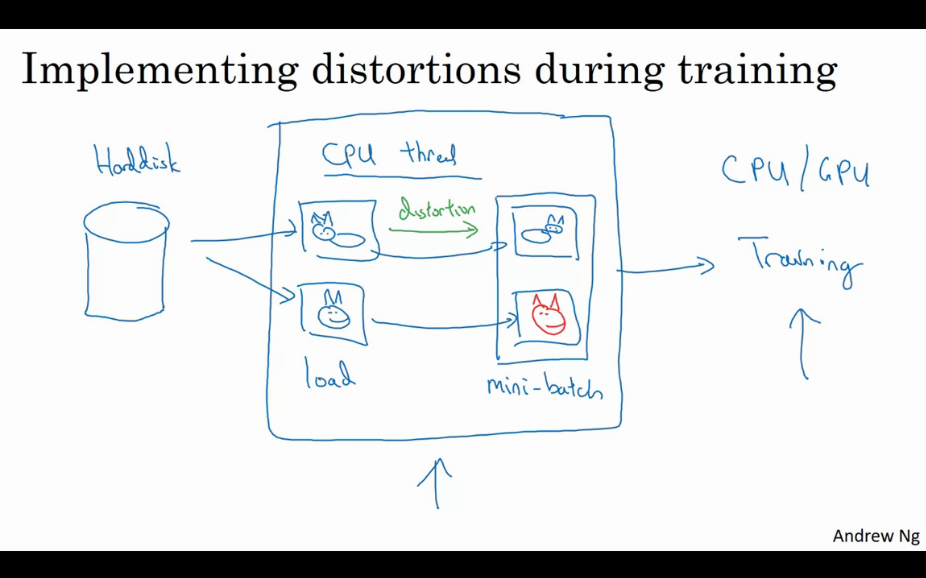

Once again, you can start with someone elses open source implementations.

### State of Computer Vision

* some unique stuff in cv when compared to other fields like speech ,...

#### data vs hand-engineering

* little-data vs lots of data
* some problems have less data (object detection for example, its very expensive to annotate bboxes)
* the more data you have the simpler your algorithm can be and this requires less hand engineering
* the less data you have the more h4x you have :)
* theres two sources of knowledge
    * labeled data
    * hand engineered features / architectures / ...
* CV likes to learn really complex functions and it feels like theres not enough. This is why the state of CV has relied more on hand engineering, and why there are more complex networks.
* historically there was not alot of data
* if you have little data, use transfer learning!

#### if you do well on a benchmark, its easier to get a paper published.

* Negative: sometimes researchers use less good techniques to get better results
* Ensembles
    * train several networks independently and average outputs ($\hat{y}$), probably will give you +1-2%
    * this slows down your running time, which makes it never used in production
* Multi-crop at test time
    * run classifier on multiple versions of test image (with data augmentation) and average results
    * for example take 10 crops and see what output is, run through classifier, ...
* slows down runtime etc
* in production its useless, but better on benchmarks / competitions

#### use open source code

* use architectures of published networks
* use OS implementations if possible
* use pretrained models and finetune on your dataset

## Batch Normalization

* normalizing can speed up gd, due to the gradients being better distributed.
* in logistic regression, we only have one thing to normalize: the input
* in deeper networks it could also be effective to normalize the hidden units
* Given some intermediate value in a neural network $\ssb{z}{l}$, compute the mean by $\mu =\frac{1}{m}\sum_{i} z^{(i)}$ and the variance $\sigma^2 = \frac{1}{m}\sum_i (z_i - \mu)^2$. Then, normalize $z_{norm}^{(i)} = \frac{z^{(i)}-\mu}{\sqrt{\sigma^2 + \epsilon}}$. Now they have mean 0 and variance 1. 
* We dont always want hidden units to have this distribution, so instead we compute $\widetilde{z}^{(i)} = \gamma z^{(i)}_{norm} + \beta$ where $\gamma, \beta$ are learnable parameters. 
* If $\gamma = \sqrt{\sigma^2 + \epsilon}$, and $\beta=\mu$, then the equation is inverted, and so $\widetilde{z}^{(i)} = z^{(i)}$ essentially the identitiy function.
* Now use $\ssb{\widetilde{z}}{l}$ instead of $\ssb{z}{l}$ for later computations.
* if you have a sigmoid activation function you dont maybe want mean / ... in order to take better advantage of the sigmoid function.

