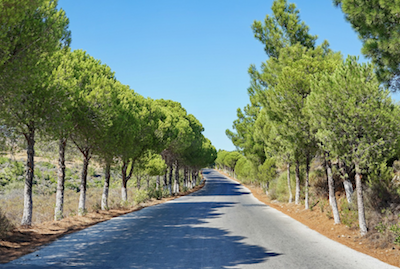

# Week 3 Quiz

## Q1 

You are building a 3-class object classification and localization algorithm. The classes are: pedestrian (c=1), car (c=2), motorcycle (c=3). What would be the label for the following image? Recall 

$$y=[pc​,bx​,by​,bh​,bw​,c1​,c2​,c3​]$$

`there is a detection, so p_c =1. bounding box X center is about 0.3~ , Y = 0.7~ , w=0.3~ h=0.3~, class is vehicle (c_2=1) `

* [x] $y = [1, 0.3, 0.7, 0.3, 0.3, 0, 1, 0]$

* [ ] $y=[1,0.7,0.5,0.3,0.3,0,1,0]$

* [ ] $y=[1,0.3,0.7,0.5,0.5,0,1,0]$

* [ ] $y=[1,0.3,0.7,0.5,0.5,1,0,0]$

* [ ] $y=[0,0.2,0.4,0.5,0.5,0,1,0]$

## Q2

Continuing from the previous problem, what should y be for the image below? Remember that “?” means “don’t care”, which means that the neural network loss function won’t care what the neural network gives for that component of the output. As before, 

$$y=[pc​,bx​,by​,bh​,bw​,c1​,c2​,c3​]$$

`want to detect car, none detected so p_c=0, rest we dnot care`

* [ ] $y=[?,?,?,?,?,?,?,?]$

* [ ] $y=[1,?,?,?,?,?,?,?]$

* [ ] $y=[0,?,?,?,?,0,0,0]$

* [x] $y=[0,?,?,?,?,?,?,?]$

* [ ] $y=[1,?,?,?,?,0,0,0]$

## Q3

You are working on a factory automation task. Your system will see a can of soft-drink coming down a conveyor belt, and you want it to take a picture and decide whether (i) there is a soft-drink can in the image, and if so (ii) its bounding box. Since the soft-drink can is round, the bounding box is always square, and the soft drink can always appears as the same size in the image. There is at most one soft drink can in each image. Here’re some typical images in your training set:

What is the most appropriate set of output units for your neural network?

`First answer: you want to know where it is and the size as well, because that determines where on the conveyor the can is. read the question floris :D second answer: the size is always constant, so only b_x and b_y are needed.`

* [ ] Logistic unit (for classifying if there is a soft-drink can in the image)

* [x] Logistic unit, $b_x, b_y$
* [] Logistic unit, $b_x, b_y, b_h$​ (since $b_w = b_h$)

* [] Logistic unit, $b_x, b_y, b_w, b_h$ 

## Q4

If you build a neural network that inputs a picture of a person’s face and outputs N landmarks on the face (assume the input image always contains exactly one face), how many output units will the network have?

* [] N `wrong!`
* [x] 2N `landmarks have an x and y position`
* [ ] 3N
* [ ] $N^2$

## Q5

When training one of the object detection systems described in lecture, you need a training set that contains many pictures of the object(s) you wish to detect. However, bounding boxes do not need to be provided in the training set, since the algorithm can learn to detect the objects by itself.

* [ ] True
* [x] False

## Q6

Suppose you are applying a sliding windows classifier (non-convolutional implementation). Increasing the stride would tend to increase accuracy, but decrease computational cost. 

* [x] false `you are using less info so the accuracy will decrease, comp cost also though`

* [ ] True

## Q7

In the YOLO algorithm, at training time, only one cell ---the one containing the center/midpoint of an object--- is responsible for detecting this object.

* [x] True `apparently true. the others dont say that theres an object, but do influence the size.`
* [ ] False  `not true it seems`

## Q8

What is the IoU between these two boxes? The upper-left box is 2x2, and the lower-right box is 2x3. The overlapping region is 1x1. 

`first answer: IoU = 1x1=1 / (2x2+2x3) = 1 / (4 + 6) = 1/10 was wrong`

`second answer: IoU union does not mean count the intersection twice. Therefore, reduce the bottom part of the pfraction by one , ie 1/ (4+6-1) = 1/9`

## Q9

Suppose you run non-max suppression on the predicted boxes above. The parameters you use for non-max suppression are that boxes with probability $\leq 0.4$ are discarded, and the IoU threshold for deciding if two boxes overlap is 0.5. How many boxes will remain after non-max suppression?

`this was wrong: 4 classes, you run NMS for each. discard any that are lt 0.4. each class has one that is higher than 0.5, so 4`

`i did not read right. iou has to be 0.5 to select only one, therefore the 2 trees are 2 boxes. 1 motorcycle. 1 pedestrian. 1 car. total = 5` 

## Q10

Suppose you are using YOLO on a 19x19 grid, on a detection problem with 20 classes, and with 5 anchor boxes. During training, for each image you will need to construct an output volume $y$ as the target value for the neural network; this corresponds to the last layer of the neural network. ($y$ may include some “?”, or “don’t cares”). What is the dimension of this output volume?

`gridsize *  #anchors * (5 (obj + bbox) + #classes)`
` 19x19x5x(5 + 20) = 19x19x5x25`

