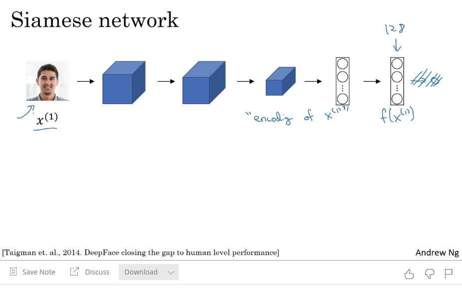
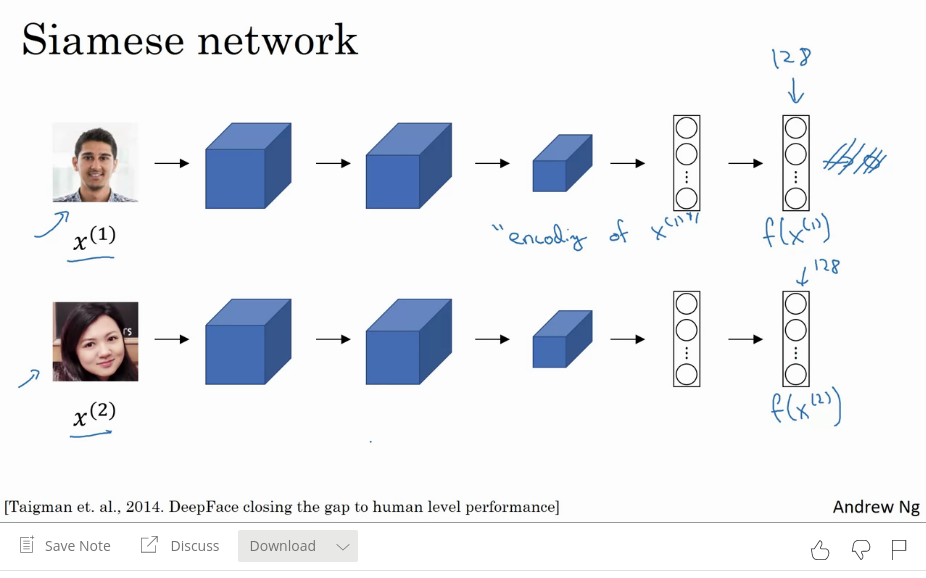
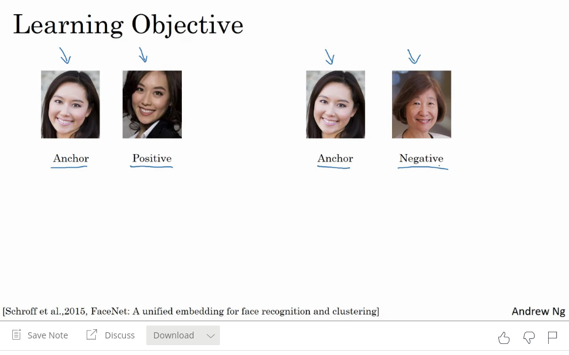
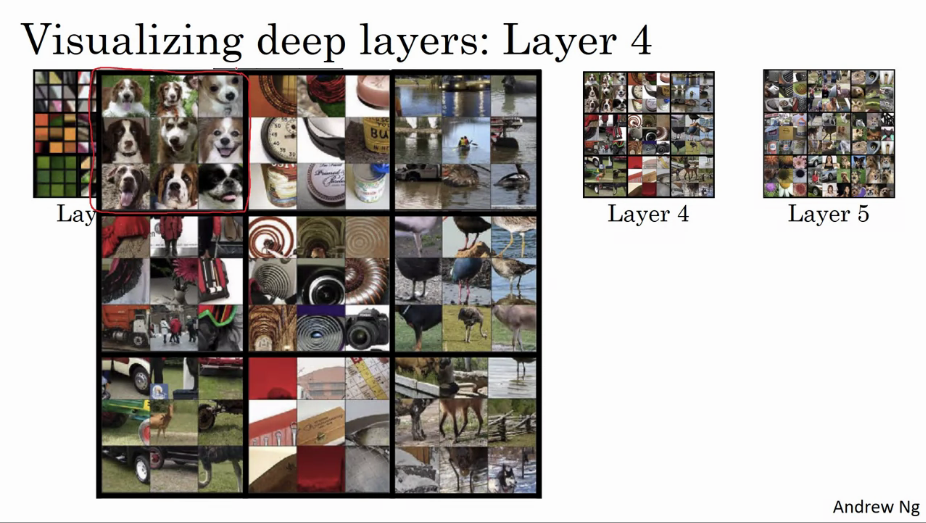

# Week 4 notes Special Applications

## Face Recognition

### Verification

* input image + name/id
* output : is input image == name

### Recognition

* has database of K persons
* get input image
* output id if the image is any of K persons

You can use the verification block in the recognition system.

### One shot learning

* Recognise a person using a single training example.
* input image -> conv -> output y=softmax()
    * this does not work well
    * too little data to be robust
    * what if you need to add someone? then the output vector shuold be larger, so you need to retrain
    * sucks

Instead, you learn a similarity function

* d(img1, img2) = degree of difference between images
* if d(img1, img2) $\leq \tau$ --> same person, if $\gt \tau$ --> different person.
* do this for everyone in your database
* if someone new appears, the degree of difference will be very big between all of these peoeple and the new person


### Siamese Network

* typical cnn

* lets focus on a fully connected layer deeper in the network. This is an encoding of the input $f(x^{(1)})$

* For face recognition, you want to compare two pictures.
* feed the second picture to the same neural network
* now yuo get as output a different encoding $f(x^{(2)})$

* if you think the encoding is good, yuo can find the distance between x_1 and x_2 as the norm of the difference between the encodings

$$ d(x^{(1)}, x^{(2)}) = || f(x^{(1)}) - f(x^{(2)}) ||^2_2$$


* this is called a siamese neural network architecture.

#### Goal of learning

* the params define an encoding $f(x^{(i)})$ with dim ie 128
* learn params so that "if $x^{(i)}$ and $x^{(j)}$ are the same person, make that the distance between the encodings is small, and if they are not the same person make sure it is large"


### Triplet loss

#### Learning objective

* you have to look at several pictures at the same time
* left images are the same person, you want encodings to be close and vice versa

* triplet loss makes sure that you always look at 3 images at the same time: an ANCHOR, a POSITIVE and A NEGATIVe image.

You want the encoding between the anchor and the positive example to be small, in particular you want it to be smaller than the distance between the encoding of the anchor and the negative sample.


However, if we always learn that the first term is zero we can always satisfy this equation. 


Lets modify the objective to be quite a bit smaller than zero, ie add a term $\alpha$ (margin). 


Different values of alpha give different results. The difference can now be achieved by either increasing the norm between anchor and negative, or decreasing the norm between anchor and positive. In other words, push the two pairs further away from eachother


The triplet loss function uses three images, A(nchor); P(ositive); N(egative) images. The loss then becomes:

$$ \mathcal{L}(A, P, N) = \textnormal{max}\Bigg(||f(A) - f(P)||^2 - ||f(A) - f(N)||^2 + \alpha, 0\Bigg)$$ 

So as long as the difference is smaller than zero, the loss on this example is equal to zero. If it is greater than zero, you get a positive loss


$$ J = \sum_{i=1}^{m} \mathcal{L}(A^{(i)}, P^{(i)}, N^{(i)})$$


`You do need a dataset that has multiple pictures per person, ie. 10k pictures of 1k persons.`

#### Choosing the triplets A, P, N

During training, if A, P, N are chosen randomly, d(A,P) + alpha <= d(A,N) is easily satisfied. Therefore, choose triplets that are "hard" to train on. 

$$ d(A, P) + \alpha \leq d(A,N)$$
$$ d(A, P) \approx d(A,N)$$


Summary: A, P, N are needed for training. Use GD to minimize the cost function J, in order to learn an encoding that will distinguish people well


`In this domain its often useful to download a pretrained model. `

### Face recognition as binary classification

* You can also train a siamese network to compute an embedding, and then use those to make a prediction usnig a logistic regression unit
* output will be 1 if same person, 0 if different person
* alternative to triplet loss
* the output $\hat{y}$ will be a sigmoid function that takes differences between encodings or something similar to below:

$$ \hat{y} = \sigma\Bigg(\sum_{k=1}^{128} w_k|f(x^{(i)}_k - f(x^{(j)})_k| + b) \Bigg)$$


In this learning formulation, the input is a pair of images, and the output is 0 or 1. The parameters in the top neural net is tied to the one in the lower network.

Implementation detail: you can precompute the embeddings and match vs database. This way you dont need to store the raw images.


* Face verification supervised learning


## Neural Style Transfer

* allows you to generate a new image drawn in a different style

Lets say you have three images: C(ontent), S(tyle) and G(enerated Image). Using the content and style, we can generate an image.


* in order to do style transfer, you have to look at shallow and deep layer outputs in a network.

### What are deep convnets really learning?

* Visualise what a network is learning
* Pick a unit in layer 1, find the nine image patches that maximize the unit's activate.
* A hidden unit in layer 1 will only see a small portion in the image.
* repeat this for other hidden units
* the image patch that a filter "sees" is the receptive field.
* early layers look at simple features such as lines


What if you do this for some hidden units in the deeper layers?

* the hidden units will see a larger region
* in the extreme case --> the last layers will have an influence of each pixel in the image.
* The red square are 9 image patches that cause one hidden unit to have a very large output
* the zoom in for layer one looks as follows:

* for layer two, the features become more complex

* layer three even more, for example a rounder shape in the bottom left of the image (wheels?)

* layer 4 are more complex. nearly a dog detector, water detector, bird legs

* layer 5 is really sophisticated such as real  animals, many different dogs...


### Cost function

* a cost function for the generated image
* remember we have C, S, G images

$$J(G) = \alpha \underbrace{J_{\textnormal{content}}(C, G)}_{\textnormal{similarity between C\&G}} + \beta \overbrace{J_{\textnormal{style}}(S, G)}^{\textnormal{how similar is the style of S\&G}}$$

* the original paper is not hard to read (gatys et al 2015)

The algorithm is as follows

* initiate G randomly: 100 x 100 x 3
* Use gradient descent to minimize J(G), which essentially updates the PIXEL values of the image G.
* Example: initialize G randomly (top right corner image)

* slowly change pixel values so that the generated image becomes closer to the original image with the style


#### Content cost function

We want to elaborate on the content cost:

$$J_{\textnormal{content}}(C, G)$$

* say you use hidden layer $l$ to compute content cost. if you use a shallow layer, you are really forcing pixel values, if you choose very deep layer you are taking the same (compelx) content. In practice this means that we have to be somewhere in the middle; not too shallow not too deep.
* use pretrained convnet
* now measure given a C, G image how similar are they in content?
* let $a^{[l](C)}$ and $a^{[l](G)}$ be the activation of layer $l$ on the images.
* if $a^{[l](C)}$ and $a^{[l](G)}$ are similar, both images have similar content. 
* define the following:

$$J_{\textnormal{content}}(C, G) = \frac{1}{2}|| a^{[l](C)} - a^{[l](G)} || ^2$$ 

* is just the L2 norm if you unrolled them (just the elemnetwise sum of squares between activations in layer $l$ between C and G). the 1/2 is just a regularization term and can be anything.
* this will incentivise the algorithm to find an image G so that the activations on layer $l$ are similar with the content image.


#### Style cost function

We want to elaborate on the style cost:

$$J_{\textnormal{style}}(S, G)$$

* What is the style of an image?
* Choose a layer $l$'s activations to define the measure of the style of the image.
* Furthermore, define style as a correlation between activations across channels.
* You have a volume of activations, and we want to figure out how correlated the activations are across channels

* how correlated are the features across the channels? So look at a row in the channel dimension.

* Intuition
    * Lets say that the red channel corresponds to channel with zebra stripes 
    
    * the second channel corresponds to the neuron that looks for vageuly orange parts
    
    * If these two are correlated, that means that whatever part of the image has this subtle vertical texture (zebra) will probably also have the orange tint
    * if they are not correlated: if you have this texture (zebra) you will likely not have the orange tint.
    * in other words: how often do they occur / not occur together.
    * now we can use the degree of correlation to measure the style of an image: how similar is the style of 1 to the other
    

Given an image, lets construct a style matrix.

* Let $a_{i,j,k}^{[l]}$ be the activations at $(i,j,k)$. $G^{[l]}$ (style matrix) is $n_c^{[l]} \times n_c^{[l]}$.

* The style matrix will measure the correlation between features
* so $G^{[l]}_{KK'}$ measures how correlated channel K is with the activations in channel K'. 

* The way you compute $G^{[l]}_{KK'}$: 

$$ G^{[l]}_{KK'} = \sum_{i}^{n_H^{[l]}}\sum_{j}^{n_W^{[l]}} a_{i,j,k}^{[l]} a_{i,j,k'}^{[l]}$$

* notice that if both of these activations are large, G will be large, and if they are small G will be small
* this correlation is actually the **unnormalized cross-covariance**, because we're not subtracting the mean and multiplying directly

* you do this for the style image and the generated image.


Now we have two matrices that capture the style of the image S and the style of the image G. These are also called the **gram matrices** (thats why we use letter G)

Now you can define the style cost as the sum of squared difference between the elementwise differences

$$J_{\textnormal{style}}^{[l]}(S, G) = || G^{[l](S)} - G^{[l](G)} ||^2_F$$

With $F$ indicating the Frobenius Norm. The authors use the normalization constant $\frac{1}{(2 n_H^{[l]} n_W^{[l]} n_C^{[l]})^2}$, but this does not matter as much because the cost is multiplied by this scaling factor (hyperparam) $\beta$.


To summarize, the style cost is

$$ J_{\textnormal{style}}^{[l]}(S, G) = \frac{1}{(2 n_H^{[l]} n_W^{[l]} n_C^{[l]})^2} \sum_k \sum_{k'} (G^{[l](S)}_{kk'} - G^{[l](G)}_{kk'})^2$$


Finally, you get better results if you take this style cost function for many different layers, weighted by some extra parameter $\lambda$. This allows you to use early, mid and later layer features for style.

$$J_{\textnormal{style}}(S, G) = \sum_l \lambda^{[l]} J_{\textnormal{style}}^{[l]} (S,G)$$

The overall cost function now becomes 

$$J(G) = \alpha \underbrace{J_{\textnormal{content}}(C, G)}_{\textnormal{similarity between C\&G}} + \beta \overbrace{J_{\textnormal{style}}(S, G)}^{\textnormal{how similar is the style of S\&G}}$$

## 1D and 3D generalizations

### 2D -> 1D
* first we looked at 2D convolutions

* it turns out that a similar idea can be applied to 1D data as well
* an EKG of a heartbeat is shown in the bottom. This is 1D data, its just a timeseries showing the voltage at each instance in time. You can convolve this with a 1D filter. A 1D filter can similarly be applied through many different positions in the data. This could be one layer for your convnet. You can extend this further to next layers, ...


### 3D -> 2D

* for example a CT scan. It takes different 'slices' through your body. 

* your data now has some height, width and some depth
* if you want to apply a convnet to this kind of data, you can extend the 2d idea to 3d as well
* now yuo have a volume that is height x width x depth x channels, you can apply a 3d filter that has teh same amount of channels and you will get a 4d output again

* this could be one layer
* you can repeat this to create a convnet over a 3D volume

In other words, you can also learn directly from 3D data. The third dimension can also be slices in time, for example in movies (ie image sequences).

## Programming assignemnt notes:

```python
sess.run(model["conv4_2"]); # retrieves tensor conv4_2, by running inference on the image and it will stop at this layer (so subsequent layers are not even executed)

X.get_shape().as_list() # returns dimensions from tensor

a_C_unrolled = tf.reshape(a_C, shape=[m, n_H*n_W, n_C]) # can also be shape=[m, -1, n_C] which unrolls everything between first and last into x-1 -dimensional

### Tesnorflow ops
tf.reduce_sum([...]) # \sum[...]
tf.square(c) # c^2
tf.subtract(a,b) # a-b

sess.run(tf.global_variables_initializer()) # init global vars
sess.run([some_layer]) #returns activations of layer


np.linalg.norm((a))
np.linalg.norm((a-b), ord='fro') #frobenius norm


```